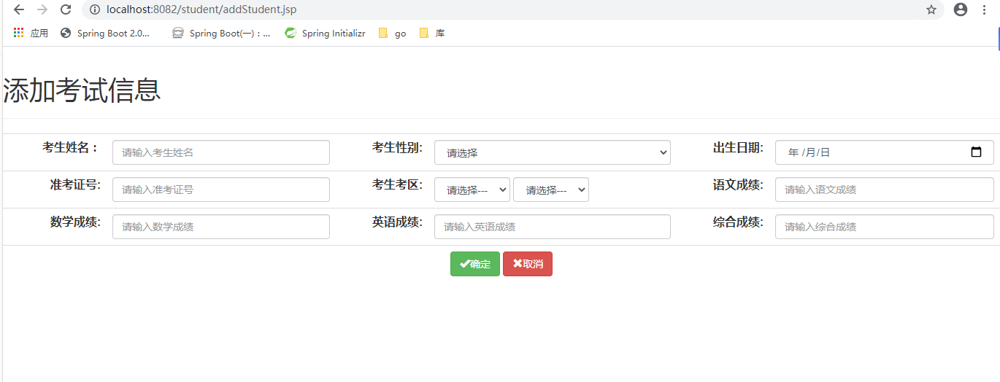

# student
学生信息管理系统

## 用到的基本框架
后台：spring+springMVC+DbUtils,tomcat  maven项目 IDEA工程

前端：jsp+bootstrap

数据库：mysql

## 本地部署

1. 在idea使用git直接拉取项目，或者下载，用idea打开
2. 数据库导入测试数据，链接地址[examdb.sql](http://blog.csdn.net/guodongxiaren "examdb.sql")

## 项目页面展示

1. 首页

2. 展示页

3. 添加页

4. 修改页

5. 统计图表页
统计图表页1

统计图表页2

统计图表页3

统计图表页4

统计图表页5
